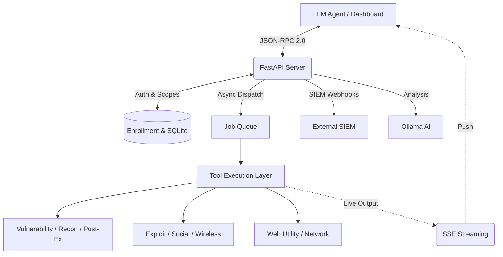

# DARK MATER | MCP Kali Server v2.0 Enterprise

<div align="center">
  
</div>

<div align="center">
  <h3>🔒 Production-Ready Security Testing Platform</h3>
  <p>A powerful, enterprise-grade Model Context Protocol (MCP) server bridging Large Language Models (LLMs) with advanced Kali Linux security testing, network reconnaissance, and vulnerability assessment tools.</p>
  <p><strong>🏢 Powered by <a href="https://zyniq.solutions">Zyniq Solutions</a></strong></p>
  
  <!-- Technology Stack Badges -->
  <p>
    
    
    
    
    
    
  </p>
  
  <!-- Status Badges -->
  <p>
    
    
    
    
    
  </p>
</div>

---

## 🌟 Key Enterprise Features

- **🌐 Standard OpenMCP JSON-RPC 2.0 (`/mcp`)**: Native protocol support for `initialize`, `tools/list`, and `tools/call` compatible with any standard MCP client or dashboard.
- **🛠️ Comprehensive Tool Modules**: Access dozens of Kali tools across 10 discrete categories: Vulnerability Scanning, Exploitation, Reconnaissance, Wireless, Social Engineering, Web Utilities, Password Cracking, Networking, Enum, and Post-Exploitation.
- **🔐 Multi-Tenancy & RBAC Scopes**: Granular client token scoping (`recon:read`, `recon:execute`, `audit:execute`, `admin:all`) and per-tenant CIDR target guardrails.
- **💾 Persistent Async Job Queue (SQLite)**: Asynchronous task tracking backed by a durable SQLite database (`jobs.db`) to ensure long-running scans survive service restarts.
- **📡 Server-Sent Events (SSE) Live Streaming**: Stream real-time stdout/stderr logs and state updates directly to clients via `GET /tools/jobs/{job_id}/stream`.
- **🛡️ Smart Guardrails & Destructive Checks**: CIDR subnet validation (`allowed_cidrs`), automated check-only modes, and strict rate-limiting.
- **📦 SIEM Audit Exporter**: Structured JSON security logging with configurable webhook export (`MCP_SIEM_WEBHOOK_URL`).
- **🐍 Python Client SDK**: Importable SDK (`darkmater_mcp.DarkMaterClient`) for rapid Python & AI agent integration.
- **🤖 Ollama AI Integration**: Built-in integration with local Ollama service for automated vulnerability summarization and tool recommendations.

---

## 🏗️ System Architecture

DARK MATER uses a decoupled, robust architecture to safely execute shell tools inside sandboxed environments while exposing a clean JSON-RPC interface for LLM agents.



---

## 🛠️ Supported Capabilities & Modules

The platform exposes wrapped command-line tools under these unified MCP capabilities:

| Category | Tools Included | Sub-Scope Identifier |
| :--- | :--- | :--- |
| **Reconnaissance** | `nmap`, `masscan`, `nikto`, `amass`, `theharvester` | `recon:*` |
| **Vulnerability** | `sqlmap`, `zap`, `openvas` (via wrappers) | `vuln:*` |
| **Exploitation** | `metasploit` (msfconsole), `cme` (CrackMapExec), `impacket` | `exploit:*` |
| **Post-Exploitation**| `hashcat`, `john`, `linpeas`, `winpeas` | `postex:*` |
| **Wireless** | `aircrack-ng`, `wifite`, `bluez` | `wireless:*` |
| **Social** | `setoolkit`, `evilginx2` | `social:*` |
| **Web Utilities** | `wpscan`, `ffuf`, `nuclei` | `utility:*` |

---

## 🚀 Quick Start & Installation

### Option 1: Docker Compose Deployment (Recommended)

All components are dockerized and managed via `docker-compose.yml`:

```bash
# 1. Clone repository
git clone https://github.com/ZYNIQ-SOLUTIONS/DARK-MATER-Kali-Linux-MCP-Server.git
cd DARK-MATER-Kali-Linux-MCP-Server

# 2. Build and start containers in detached mode
docker-compose up -d --build

# 3. View live server logs
docker-compose logs -f kali-api
```

### Option 2: Native Linux Installation (Systemd)

```bash
# 1. Run automated installer (requires root)
curl -sSL https://raw.githubusercontent.com/khalilpreview/MCP-Kali-Server/main/install.sh | sudo bash

# 2. Start server service
sudo systemctl start mcp-kali-server

# 3. Verify status
sudo systemctl status mcp-kali-server
```

---

## 🔐 Credentials & Security Best Practices

### 1. Protect Your Enrollment Token
The `enroll.json` token is required to generate API Keys. Do not leak this file.
```bash
# View your enrollment configuration
cat /etc/mcp-kali/enroll.json
```

### 2. Generate Tenant API Keys
```bash
curl -sS -X POST http://localhost:5000/enroll \
  -H "Content-Type: application/json" \
  -d '{
    "id": "kali-docker-test",
    "token": "<YOUR_SECRET_TOKEN>",
    "label": "Production-Lab-1"
  }'
```
*Save the returned `api_key`. It must be passed in the `Authorization: Bearer <api_key>` header.*

### 3. Enforce CIDR Guardrails
Always define explicitly allowed target ranges in `/etc/mcp-kali/scope.json`:
```json
{
  "allowed_cidrs": [
    "10.0.0.0/8",
    "192.168.0.0/16",
    "127.0.0.1/32"
  ],
  "allow_destructive": false
}
```

---

## 📖 Complete API Reference

### 1. Server Health Check
```bash
curl -sS -H "Authorization: Bearer YOUR_API_KEY" "http://localhost:5000/health"
```

### 2. OpenMCP JSON-RPC 2.0 Standard (`/mcp`)
```bash
# Execute Tool via OpenMCP
curl -sS -X POST "http://localhost:5000/mcp" \
  -H "Authorization: Bearer YOUR_API_KEY" \
  -H "Content-Type: application/json" \
  -d '{
    "jsonrpc": "2.0",
    "method": "tools/call",
    "params": {
      "name": "recon.nmap_scan",
      "arguments": { "target": "127.0.0.1", "fast": true }
    },
    "id": 1
  }'
```

### 3. Asynchronous Job Execution & SSE Event Streaming
```bash
# 1. Submit an Async Background Job
JOB_ID=$(curl -sS -X POST "http://localhost:5000/tools/jobs" \
  -H "Authorization: Bearer YOUR_API_KEY" \
  -H "Content-Type: application/json" \
  -d '{
    "name": "recon.nmap_scan",
    "arguments": { "target": "192.168.65.0/24" }
  }' | jq -r '.job_id')

# 2. Stream Real-Time SSE Updates
curl -N -H "Authorization: Bearer YOUR_API_KEY" \
  "http://localhost:5000/tools/jobs/${JOB_ID}/stream"
```

---

## 🐍 Python Client SDK Usage

The Python SDK (`sdk/python/darkmater_mcp/`) offers an intuitive, typed interface for AI integrations:

```python
from darkmater_mcp import DarkMaterClient

# Initialize client
client = DarkMaterClient(base_url="http://localhost:5000", api_key="YOUR_API_KEY")

# 1. Synchronous Execution
scan_result = client.call_tool("recon.nmap_scan", {"target": "127.0.0.1", "fast": True})
print("Scan Summary:", scan_result.get("summary"))

# 2. Asynchronous Execution
job_id = client.submit_job("recon.nmap_scan", {"target": "127.0.0.1"})
for event in client.stream_job(job_id):
    if event['status'] == 'output':
        print(f"[{event['stream']}] {event['content']}")
```

---

## 🧪 Automated E2E Testing Suite

DARK MATER ships with a comprehensive test suite covering the core MCP APIs, standard operations, unit tests, and LLM configuration routines:

```bash
# Ensure FastAPI & Pytest are installed
pip install -r requirements.txt

# Run full test suite
python3 tests/run_tests.py
```

---

## 📄 License & Commercial Support

**DARK MATER MCP Kali Server** is a private, commercial security platform powered by **Zyniq Solutions**.

- **Company**: [Zyniq Solutions](https://zyniq.solutions)
- **Support**: [contact@zyniq.solutions](mailto:contact@zyniq.solutions)
- **License**: Commercial / Private Access
